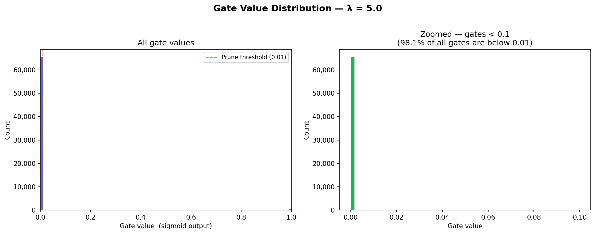

# Self-Pruning Neural Network

A neural network that learns to prune its own weights **during training** using
learnable gate parameters and L1 sparsity regularization, trained on CIFAR-10.

---

## Overview

This project implements a **self-pruning neural network**, where each weight is
controlled by a learnable gate. During training, the model automatically removes
unnecessary connections, resulting in a sparse and efficient network.

---

## Core Idea

Each weight `w_ij` has a corresponding gate score `g_ij`. During the forward pass:

```
gates    = sigmoid(g_ij)      # values in (0, 1)
W_pruned = W * gates          # suppress inactive weights
output   = W_pruned @ x + b
```

Training objective:

```
Total Loss = CrossEntropy + λ * Σ sigmoid(g_ij)
```

* CrossEntropy → preserves accuracy
* L1 sparsity term → pushes gates toward zero

Weights with near-zero gates are effectively **pruned during training**.

---

## How to Run

```bash
pip install -r requirements.txt
python self_pruning_nn.py
```

Optional arguments:

```bash
python self_pruning_nn.py --lambda_ 1.0 --epochs 30
```

---

## Results

| Lambda | Test Accuracy | Sparsity |
| ------ | ------------- | -------- |
| 0.1    | 77.01%        | 67.76%   |
| 1.0    | 75.80%        | 92.61%   |
| 5.0    | 73.57%        | 98.13%   |

### Key Insight

* Increasing λ increases sparsity
* Even at **98% sparsity**, the model retains strong performance
* Indicates high redundancy in dense neural networks

---

## Gate Distribution



The distribution is **bimodal**:

* Spike near 0 → pruned weights
* Cluster away from 0 → important weights

This confirms successful self-pruning behavior.

---

## Architecture

```
Input (3×32×32)
    ↓
Conv → BN → ReLU → Pool
Conv → BN → ReLU → Pool
Conv → BN → ReLU → Pool
    ↓
Flatten
    ↓
PrunableLinear → ReLU → Dropout
PrunableLinear → ReLU → Dropout
PrunableLinear
    ↓
Output (10 classes)
```

---

## Repository Structure

```
self-pruning-nn/
├── self_pruning_nn.py
├── requirements.txt
├── README.md
└── report/
    ├── report.md
    └── gate_dist.png
```

---

## Key Features

* Learnable gating mechanism for weights
* Differentiable pruning during training
* L1-based sparsity regularization
* Achieves up to **98% parameter sparsity**
* No post-training pruning required

---

## Conclusion

This project demonstrates that neural networks can **learn to prune themselves**
during training using simple regularization techniques.

It achieves significant model compression with minimal accuracy loss, making it
a practical approach for efficient deep learning.
